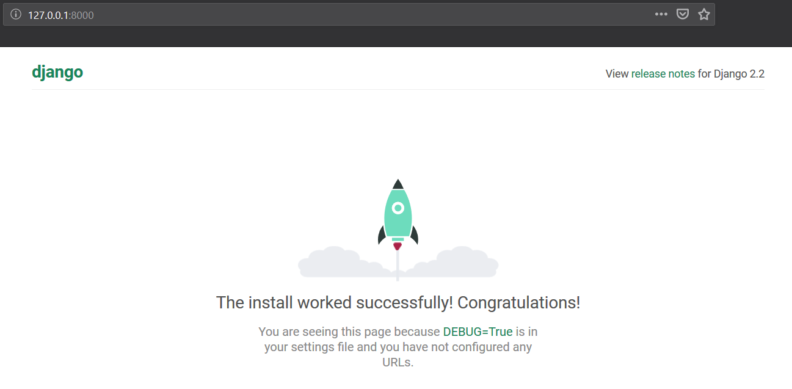
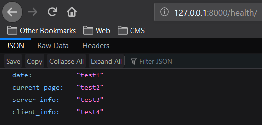
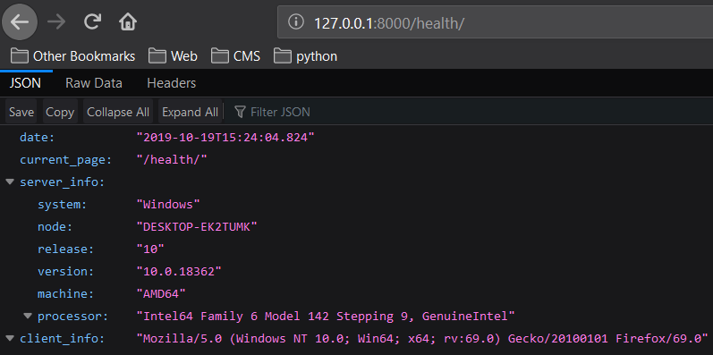

# Lab_3: Вступ до моніторингу.

1. Ініціалізовую середовище pipenv та встановлюю необхідні пакети:

        pipenv --python 3.7
        pipenv install django
   
2. За допомогою Django Framework створюю заготовку проекту. Для зручності винношу всі створені файли на один рівень вище:

        pipenv run django-admin startproject web_site
       
        mv web_site/web_site/* web_site/
        mv web_site/manage.py ./
        
3. Переконуюсь що все встановилось правильно і можна запустити Django сервер. Виконую команду вказану нижче та переходжу за посиланням яке вивелось у консолі:
    
        pipenv run python manage.py runserver
    
    
4. Зупиняю сервер виконавши переривання Ctrl+C. Створюю коміт із базовим темплейтом сайту.
5. Далі створюю темплейт додатку (app) у якому буде описано всі web сторінки сайту. Створюю коміт із новоствореними файлами темплейту додатка:

        pipenv run python manage.py startapp main
        
6. Використовуючи можливості IntelliJ створюю папку `main/templates/`, а також у даній папці файл `main.html`. Також у папці додатку створюю ще один файл `main/urls.py`. Роблю коміт із даними файлами.
7. Вказую Django frameworks назву створеного додатку та де шукати веб сторінки. Це здійснюється у файлі `web_site/settings.pyу` у змінній `INSTALLED_APPS`, а також вношу зміни у файл `web_site/url.py`.
8. Змінюю вміст файла `main/views.py`.
9. Щоб поєднати функції із реальними URL шляхами за якими будуть доступні веб сторінки заповнюю файл `main/urls.py` згідно зразка.
10. Запускаю сервер та переконуюсь що сторінки доступні:
    
    
    
    Виконую коміт робочого Django сайту.
11. Встановлюю бібліотеку `requests`:
        
        pipenv install requests
        
12. Відкриваю сторінку `/health/` у браузері:

    
13. i. Модифікую функцію `health` так щоб у відповіді були: згенерована на сервері дата, URL сторінки моніторингу, інформація про сервер на якому запущений сайт(використовую `platform`, тому, що `os` не підтримується в Windows) та інформація про клієнта який робить запит до сервера:

    
    
    ii. Дописую функціонал який буде виводити повідомлення про недоступність сайту у випадку якщо WEB сторінка недоступна;
    
    iii. Переробляю `monitoring.py` так щоб дана програма запускалась раз в хвилину та працювала в бекграунді. 
    
    iv. Роблю аліас на запус моніторингу, тепер він виглядає так:
        
        pipenv run monitoring  
14. Запускаю сервер та переконуюсь що головна сторінка відображається. Переходжу у інше вікно консолі та запускаю програму моніторингу. Роблю коміт файла логів `server.logs` до репозиторію.